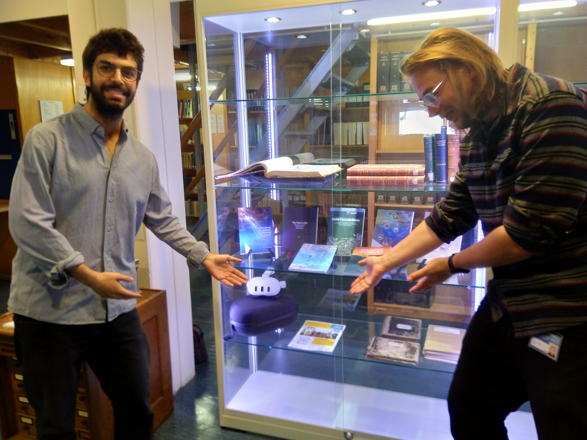
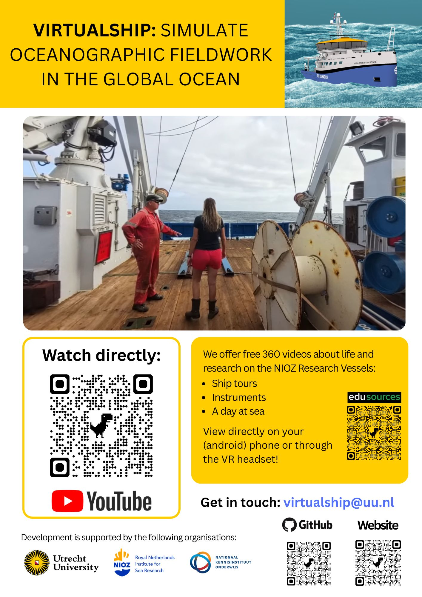

Yesterday, 21 May 2026, our team travelled from Utrecht to deliver to NIOZ Texel a Meta Quest S3 headset containing the VR/360° educational videos developed within VirtualShip.
After meeting with several departments, Emma Daniels (Postdoc) and Gonçalo Albergaria (Research Officer) wrapped up the outing on a celebratory note, meeting Daan van Loon, a staunch defender of Open Science and the institute’s librarian, to bestow the library with a VR headset and VirtualShip explanatory booklet.
Amongst the several NIOZ research vessel 360° tours and videos on how to use and deploy ADCPs, CTDs and drifters, the equipment is specifically NIOZ targeted with eight in-depth 360° video interviews on the workflow and outcomes of the NIOZ 64PE550 DUST2025 expedition. More to come!

